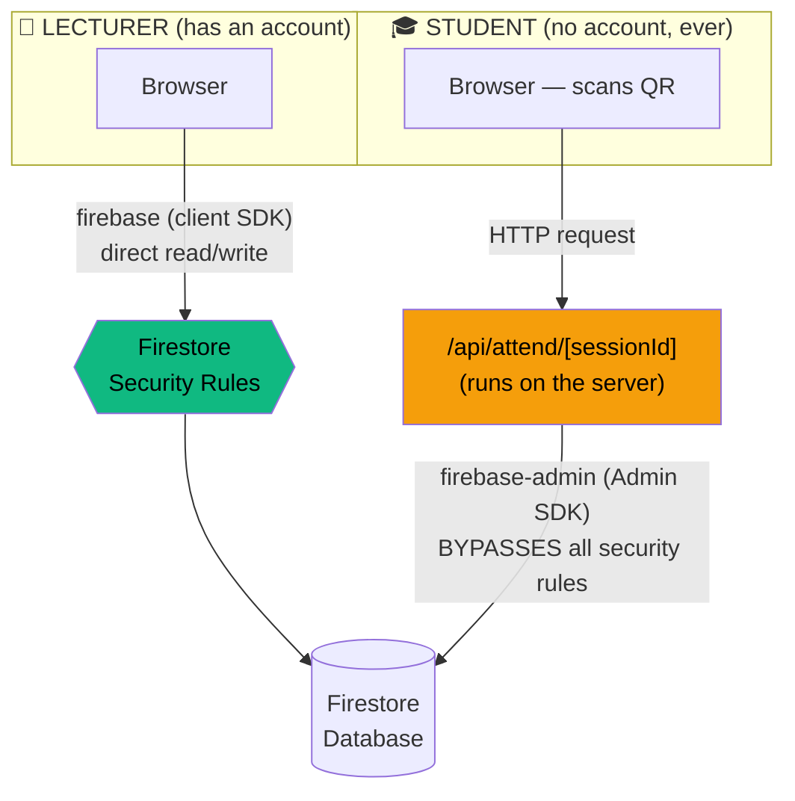
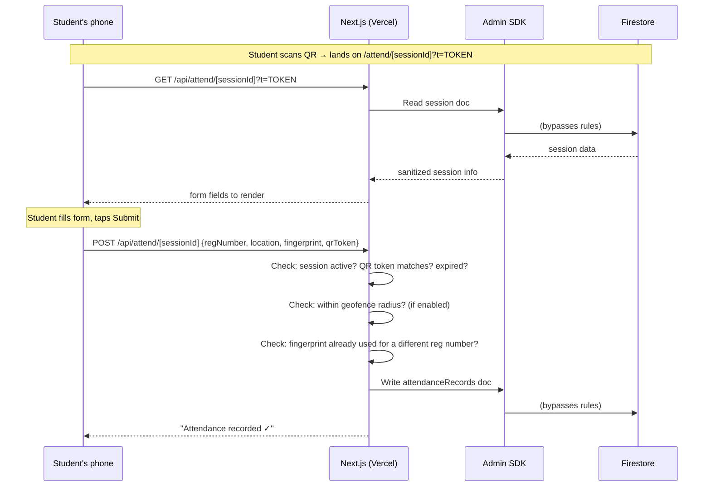
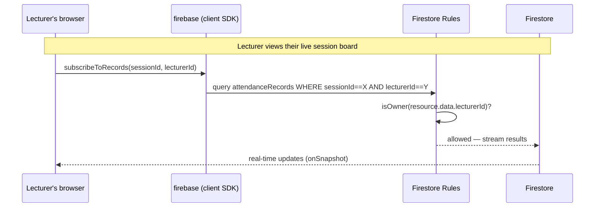

# 03 — Architecture

**Read this file before touching any code.** Almost every real bug this
project has hit traced back to the one idea in this document.

## The single most important concept: two separate pathways

RollMark has exactly two kinds of people who ever touch it, and they reach
the database through **two completely different, deliberately separate
pathways**:



**Lecturers** talk to Firestore *directly* from their browser, using the
regular `firebase` client library. Every single thing they're allowed to do
is governed by `firestore.rules` (see `06-firestore-rules.md`) — the
database itself enforces "you can only read/edit your own courses and
sessions," no separate backend check needed.

**Students never get a Firestore connection at all.** They only ever talk to
one thing: a Next.js API route (`/api/attend/[sessionId]`) running on
Vercel's servers. That route uses `firebase-admin` — a completely different
SDK that runs credential-based, full-trust access to the database and
**ignores Firestore security rules entirely**. All the actual fraud-checking
logic (QR token validity, geofence distance, duplicate device, session
expiry) runs as plain server-side code inside that one API route, not as
database rules.

**Why split it this way?** Firestore security rules can express "is this the
document's owner" — they cannot express "is this GPS coordinate within 50
meters of that GPS coordinate" or "has this exact device fingerprint already
submitted for this session." Those checks need real code, which means they
need a real server, which means the student-facing side of the app can't be
a direct-to-database client the way the lecturer side is.

## Full request-flow diagram





## Folder structure and what lives where

```
src/
├── app/                          Next.js App Router — one folder = one URL route
│   ├── page.tsx                  Public landing page  (/)
│   ├── auth/                     Lecturer signup/login pages
│   ├── dashboard/                Everything behind login — gated by middleware.ts
│   │   ├── layout.tsx             Server-side re-check of the session cookie
│   │   ├── sessions/create/       "Create attendance session" page
│   │   ├── sessions/[sessionId]/  Live session board + its history sub-page
│   │   ├── courses/               Manage courses + roster upload + share links
│   │   ├── records/               Search/export all attendance records
│   │   ├── analytics/             Trends + at-risk students
│   │   └── settings/              Profile + notification preferences
│   ├── attend/[sessionId]/        THE public page students land on after scanning
│   ├── s/[slug]/                  The public "static share link" page (per course)
│   └── api/
│       ├── attend/[sessionId]/    Handles all student attendance submissions
│       ├── auth/session/          Creates/destroys the httpOnly login cookie
│       ├── share/[slug]/          Public API behind the /s/[slug] share page
│       └── cron/weekly-summary/   Scheduled job — emails lecturers a weekly digest
├── components/
│   ├── ui/                       Small reusable pieces (Button, Input, Toggle, Modal...)
│   ├── molecules/                Slightly bigger pieces built from ui/ (QRDisplay, LocationPill...)
│   ├── organisms/                Whole page sections (LiveSessionBoard, AttendanceForm...)
│   └── shells/                   Page wrappers (AppShell = dashboard nav, PublicShell = public pages)
├── lib/
│   ├── firebase.ts                Client SDK setup — used by lecturer-facing code
│   ├── firebase-admin.ts          Admin SDK setup — used ONLY inside API routes
│   ├── firestore.ts               Every lecturer-facing database read/write function
│   ├── auth-context.tsx           React context — tracks the logged-in lecturer everywhere
│   ├── geolocation.ts             Browser GPS wrapper, with a low-accuracy fallback
│   ├── fingerprint.ts             Device fingerprint wrapper
│   ├── qrToken.ts                 QR rotation logic (60-second rotating token)
│   ├── utils.ts                   Small helpers (date formatting, distance math, timezone-safe parsing)
│   ├── actions/session-actions.ts Server Actions for session mutations (rotate QR, end session, etc.)
│   └── server/                    Server-only code — email templates and sending
├── middleware.ts                  Gatekeeper — redirects based on login state, on every request
└── types/index.ts                 Every TypeScript type/interface used across the whole app
```

## Server Components, Client Components, and Server Actions

Next.js's App Router mixes three different execution models, and this
project uses all three deliberately:

- **Server Components** (the default) — most `page.tsx` files. Render on
  Vercel's servers, can talk to the Admin SDK directly, never ship their
  code to the browser.
- **Client Components** (files starting with `"use client"`) — anything
  interactive: forms, live-updating boards, buttons with `onClick`. These
  run in the browser and use the regular `firebase` client SDK.
- **Server Actions** (`src/lib/actions/session-actions.ts`) — functions
  marked `"use server"` that a Client Component can call directly, as if
  they were a local function, but they actually run back on the server.
  Used here for anything a lecturer triggers that needs the Admin SDK's
  power (rotating a QR token, force-ending a session) without needing a
  full separate API route.

## The `/attend` vs `/s/[slug]` distinction

These are two different public pages that look similar but solve different
problems:

| | `/attend/[sessionId]` | `/s/[slug]` |
|---|---|---|
| Who reaches it | A student, by scanning the actual QR code | Anyone with the link — meant for a course rep to display it, or for it to be posted in a class group |
| What it shows | The attendance form itself | A *live, rotating QR code* — the same one shown on the lecturer's own screen |
| Gate to access it | The QR token must match the current one | Optional GPS range check against the classroom's saved location |
| Purpose | The actual attendance submission | Solves "the lecture hall has no projector, so how does everyone see the QR?" without passing the lecturer's own phone around |
| Is it per-session or reusable? | New link every session (tied to one `sessionId`) | **Reusable forever** — tied to a course, not a session; always shows whichever session is currently live |

See `08-pages-audit.md` for the full breakdown of every page, and
`04-data-model.md` for exactly what fields make this possible.
