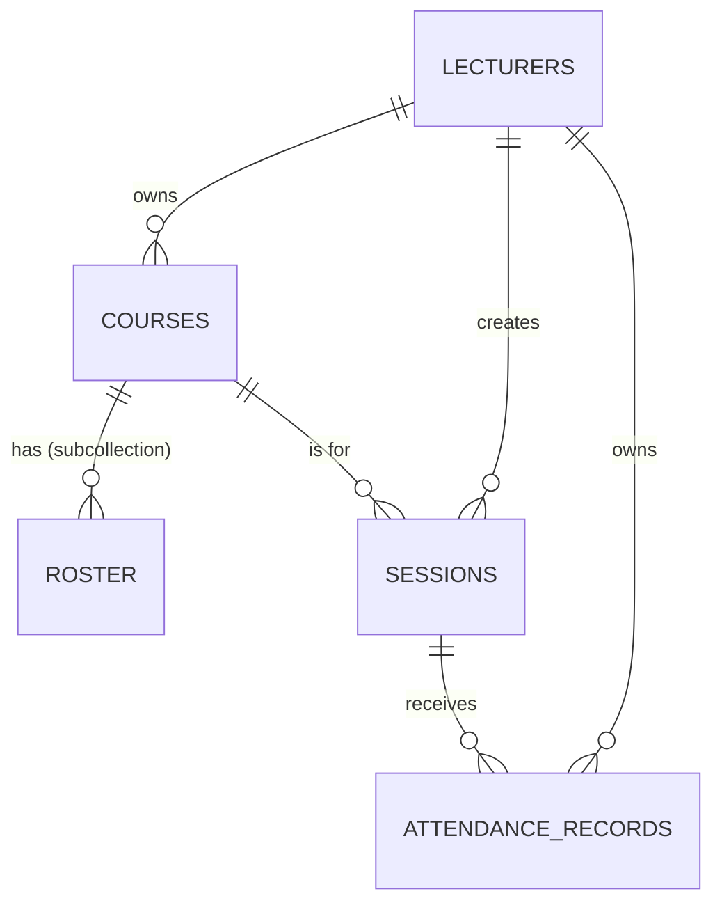
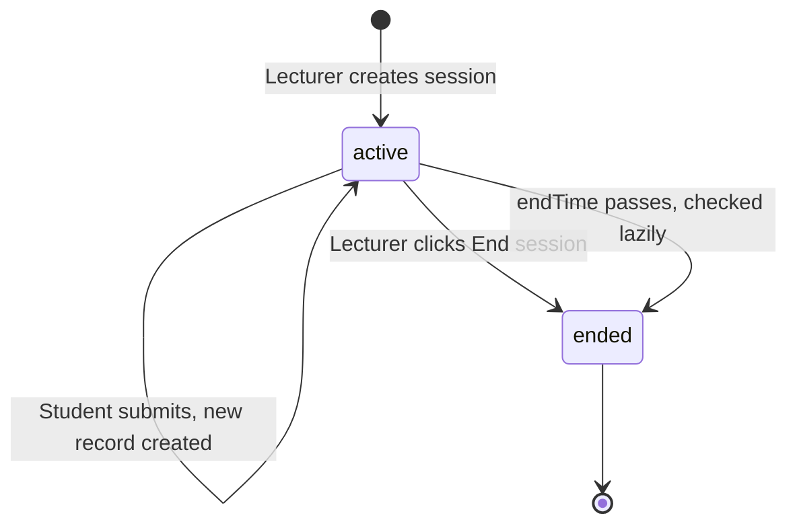

# 04 — Data Model

RollMark's database is **Firestore** — a NoSQL document database. Think of
it as nested folders: a "collection" is a folder, a "document" is a file
inside it, and a document can itself contain another collection (a
sub-folder).

There are **four collections**, all at the top level (not nested under each
other, despite what the original project spec proposed — see the note at
the bottom of this file on why that changed).



---

## 1. `lecturers/{uid}`

One document per lecturer account. The document ID (`{uid}`) is the same ID
Firebase Authentication assigns that user — this is how login identity and
database ownership are linked everywhere in the app.

| Field | Type | Notes |
|---|---|---|
| `uid` | string | Matches the Firebase Auth user ID |
| `name` | string | Display name shown in the dashboard |
| `email` | string | |
| `department` | string (optional) | Shown in Settings |
| `photoURL` | string (optional) | Avatar, uploaded to Cloudinary |
| `notifications.sessionEndEmail` | boolean | Whether to email when a session ends |
| `notifications.duplicateDeviceAlert` | boolean | Whether to email on a fraud flag |
| `notifications.weeklySummary` | boolean | Whether to receive the weekly digest email |

**Who can read/write it:** only the lecturer themselves (`isOwner(uid)` in
`firestore.rules`).

---

## 2. `courses/{courseId}`

One document per course a lecturer manages (e.g. "PHY112 — Physics").

| Field | Type | Notes |
|---|---|---|
| `lecturerId` | string | Which lecturer owns this course |
| `code` | string | e.g. `"PHY112"` — always stored uppercase |
| `name` | string | e.g. `"Physics"` |
| `rosterCount` | number | How many students are in the uploaded roster |
| `shareSlug` | string | The unique part of the static share link — `rollmark.vercel.app/s/{shareSlug}` |
| `shareGeofenceEnabled` | boolean | Whether opening the share link requires being physically near the classroom |
| `shareGeofence` | `{ center: GeoPoint, radiusMeters: number }` (optional) | The saved classroom location + allowed radius, only present if the above is `true` |
| `createdAt` | number (timestamp) | |

### Sub-collection: `courses/{courseId}/roster/{regNumber}`

The list of students expected in this course, uploaded once as a CSV. The
**document ID is the student's registration number itself** (uppercased) —
this is a deliberate choice: it means checking "is this student on the
roster?" during attendance submission is a single, fast document lookup by
ID, not a search query.

| Field | Type |
|---|---|
| `regNumber` | string |
| `firstName` | string |
| `lastName` | string |
| `email` | string (optional) |

---

## 3. `sessions/{sessionId}`

One document per attendance session (one lecture's worth of attendance-taking).

| Field | Type | Notes |
|---|---|---|
| `lecturerId` | string | |
| `courseId` | string | |
| `courseCode` / `courseName` | string | Copied from the course at creation time, so the session still shows the right course name even if the course is later renamed |
| `requireGeofence` | boolean | Whether students must be physically near the lecturer to mark attendance |
| `geofence` | `{ center: GeoPoint, radiusMeters: number }` (optional) | Present only if `requireGeofence` is `true` |
| `fields` | array of `SessionField` | Which form fields students fill in, and whether each is required/optional/off (see below) |
| `date` | string | ISO date, e.g. `"2026-07-05"` |
| `startTime` / `endTime` | string | Naive ISO datetime strings (no timezone) — always Nigeria/WAT time, see the timezone note below |
| `qrToken` | string | The current valid QR token — changes every 60 seconds while the session is active |
| `qrTokenUpdatedAt` | number (timestamp) | When the token last rotated |
| `status` | `"active"` or `"ended"` | |
| `createdAt` | number (timestamp) | |
| `studentsMarked` | number | A running counter, incremented/decremented directly — this is what the dashboard's "students marked" count reads, and it's a **separate number from actually counting `attendanceRecords` documents** (see the note on this in `09-known-issues-and-roadmap.md`, it's caused real confusion before) |

### `SessionField` shape

```ts
{
  key: string;          // e.g. "regNumber"
  label: string;        // e.g. "Reg Number" — shown to the student
  requirement: "required" | "optional" | "off";
  custom?: boolean;     // true if the lecturer added this field themselves
}
```

### A note on `mode` vs `requireGeofence`

Older session documents (created before a mid-project refactor) may still
have a field called `mode` set to `"STRICT"` or `"PERMISSIVE"` instead of
`requireGeofence`. Every place in the code that reads a session
automatically treats `mode === "STRICT"` as equivalent to
`requireGeofence: true` for backward compatibility — there was never a data
migration run for old documents, the code just quietly handles both shapes
forever. If you're reading raw data straight out of the Firebase Console and
see `mode` instead of `requireGeofence`, that's why, and it's expected.

---

## 4. `attendanceRecords/{recordId}`

One document per individual student's attendance submission.

| Field | Type | Notes |
|---|---|---|
| `sessionId` | string | Which session this belongs to |
| `lecturerId` | string | Copied from the session — **this field is essential**, not just convenient (see `06-firestore-rules.md` for why) |
| `courseCode` | string | |
| `regNumber` | string | Uppercased |
| `firstName` / `surname` / `middleName` | string | |
| `phone` / `email` | string (optional) | |
| `location` | `GeoPoint` (optional) | The student's GPS reading at submission time, if geofencing was on |
| `distanceFromLecturerMeters` | number (optional) | How far the student was from the lecturer's saved location |
| `deviceFingerprint` | string | The FingerprintJS-generated device ID, or the literal string `"manual"` if the lecturer added this student by hand |
| `flagged` | boolean | `true` if this device fingerprint was already used for a *different* reg number in this same session |
| `flagReason` | string | |
| `markedManually` | boolean | `true` if the lecturer typed this in themselves rather than the student submitting it |
| `submittedAt` | number (timestamp) | |

**Why this is its own top-level collection, not a sub-collection of
sessions, and not an array field on the session document (as the original
project spec proposed):** an array field would require re-writing the
*entire* array on every single submission (Firestore has no "append to
array field" operation that scales well under concurrent writes from many
students submitting within seconds of each other), and it would make
security rules and querying ("show me all of this lecturer's records across
every course," used on the Records page) much harder to express. A flat,
independently-queryable collection solved both problems.

---

## `GeoPoint` shape (used inside several documents above)

```ts
{
  lat: number;
  lng: number;
  accuracy: number;   // meters, from the device's own GPS accuracy reading
}
```

---

## Timezone handling — read this before touching any date/time comparison

`date`, `startTime`, and `endTime` on a session are stored as **naive**
datetime strings with no timezone suffix (e.g. `"2026-07-05T23:00:00"`),
built directly from a lecturer's `<input type="date">` / `<input
type="time">` in their browser — which is always physically in Nigeria.

This becomes a real bug risk anywhere that string gets compared against
"the current time" **on the server**, because Vercel's servers run in UTC,
not WAT (Nigeria is UTC+1, no daylight saving, always). A plain
`new Date(startTime)` on the server would silently be off by one hour.

The fix used throughout this codebase: `parseNaijaDateTime()` in
`src/lib/utils.ts` explicitly appends `+01:00` to any naive datetime string
before parsing it, so the comparison is correct regardless of which
timezone the server happens to be running in. **Any new code that compares
a session's `endTime` (or similar) against "now" must use this helper, not
a plain `new Date(...)` call.**

---

## How a session's data actually changes over its lifetime



**Important:** sessions do **not** auto-end via a scheduled background job.
Ending an expired session happens **lazily** — the moment *anyone* accesses
that session (a student trying to submit, or the lecturer's own dashboard
listing their sessions), the code checks if `endTime` has passed and, if so,
flips `status` to `"ended"` right then. This was a deliberate architecture
decision to avoid needing Vercel Cron (which is severely rate-limited on
free/Hobby hosting plans) — see `09-known-issues-and-roadmap.md` for the
full reasoning.
