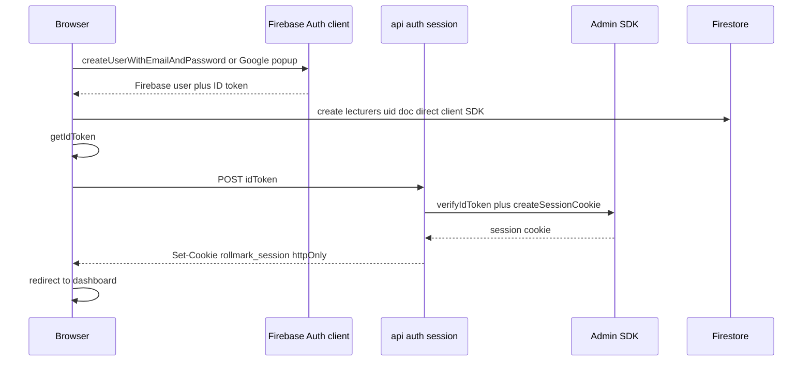
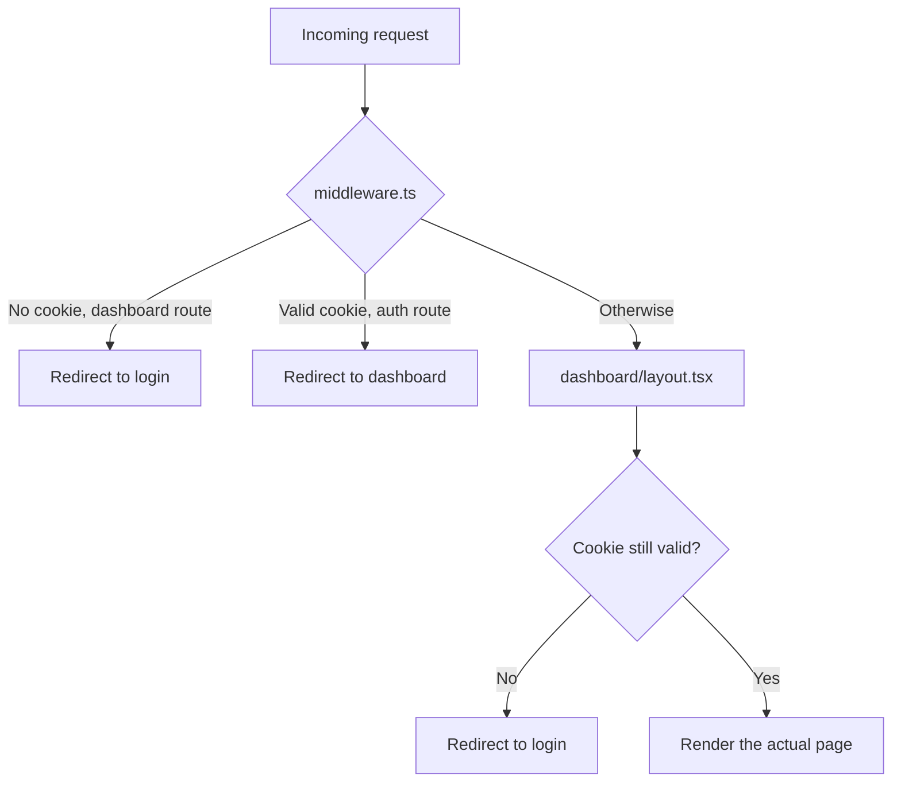
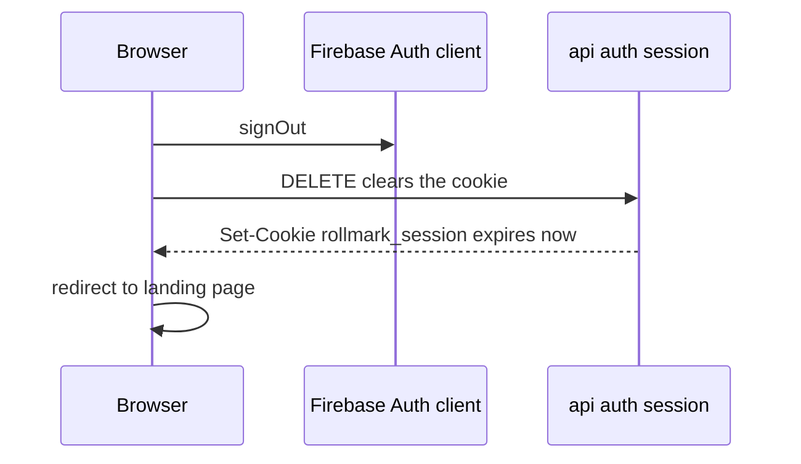

# 05 — Authentication Flow

Only lecturers ever authenticate. Students never see a login screen anywhere
in this app.

## The core idea: two separate auth systems working together

This project uses **two different authentication mechanisms at the same
time**, and understanding why is essential to debugging anything login-related:

1. **Firebase Auth (client-side)** — the actual login system. Runs in the
   browser. Handles email/password and Google sign-in. Firestore's own
   security rules check *this* identity when the lecturer's browser talks
   directly to the database.
2. **An httpOnly session cookie (server-side)** — a separate, traditional
   cookie-based session, created by a Next.js API route right after Firebase
   Auth confirms login. This is what `middleware.ts` and `dashboard/layout.tsx`
   check to decide whether to let a request into `/dashboard/*` at all —
   **before the page ever starts loading**, on the server, without needing
   the browser's Firebase SDK to have finished initializing yet.

These two systems being separate is not an accident or unnecessary
complexity — it's *why* the dashboard can be gated at the server level
(fast, secure, works even if JavaScript hasn't loaded yet) while still
letting the lecturer's browser talk directly to Firestore afterward (fast,
real-time, no extra backend round-trip for every read).

## Sign-up flow

## Sign-in flow

Identical to sign-up from the "get an ID token" step onward — the only
difference is `signInWithEmailAndPassword` (or the Google popup) instead of
creating a new account, and no new `lecturers/{uid}` document is created
(the existing one is just read).

## What actually happens on every single page request after that

Two separate checks happen for every dashboard request — this looks
redundant but isn't:

1. **`middleware.ts`** runs first, on every request matching `/dashboard/*`
   or `/auth/*`, before any page code runs at all. It reads the
   `rollmark_session` cookie and calls
   `adminAuth().verifySessionCookie()` to confirm it's still valid.
2. **`dashboard/layout.tsx`** re-checks the exact same cookie again, inside
   the actual page render. This looks like duplicate work, but middleware
   in Next.js can, in some edge/caching scenarios, be skipped for certain
   request types — the layout-level check is the belt-and-suspenders
   guarantee that a logged-out user can never see dashboard content, full
   stop, regardless of what middleware did or didn't catch.

## Why `middleware.ts` and not `proxy.ts`

Next.js 16 introduced `proxy.ts` as the new name for this exact file, with
`middleware.ts` marked deprecated. **This project deliberately still uses
`middleware.ts`** — there is an active, unresolved Next.js 16 bug
(vercel/next.js#87071) where `proxy.ts` causes real 500 errors in production
on Vercel for RSC prefetch requests. The logic is otherwise identical; only
the filename, function name, and one extra `runtime: "nodejs"` config line
differ. See the comment block at the top of `src/middleware.ts` for the
exact details and a link to revert once Vercel ships a fix.

## Why the client-side Firebase Auth "ready" state matters separately

There's a **third** timing issue worth knowing about, unrelated to the
cookie: the browser's own Firebase Auth SDK needs a moment after page load
to restore the logged-in user from its local storage. Any component that
fires a Firestore query (via the client SDK) *before* that restoration
finishes will have its request rejected by Firestore security rules — not
because the person isn't logged in, but because the client SDK hasn't
attached an identity to the request yet.

This is why you'll see `if (!user) return;` guards before Firestore
subscriptions throughout the dashboard components (e.g.
`LiveSessionBoard.tsx`) — `user` here comes from `useAuth()`
(`src/lib/auth-context.tsx`), and is `null` until Firebase Auth's own
`onAuthStateChanged` listener fires for the first time. Skipping this guard
was the root cause of a real, previously-shipped bug where the live session
board's attendance list silently failed with `permission-denied`.

## Sign-out flow

## Where this all lives in the codebase

| File | Role |
|---|---|
| `src/lib/firebase.ts` | Client SDK setup (the actual Firebase project config) |
| `src/lib/firebase-admin.ts` | Admin SDK setup, server-only |
| `src/lib/auth-context.tsx` | React context — `useAuth()` gives any component the current lecturer, and handles syncing the httpOnly cookie whenever auth state changes |
| `src/app/api/auth/session/route.ts` | Creates (`POST`) and destroys (`DELETE`) the httpOnly session cookie |
| `src/middleware.ts` | The first-line gate on every request |
| `src/app/dashboard/layout.tsx` | The second, authoritative gate, re-checked per page render |
| `src/app/auth/lecturer-login/page.tsx`, `lecturer-signup/page.tsx` | The actual login/signup forms |
