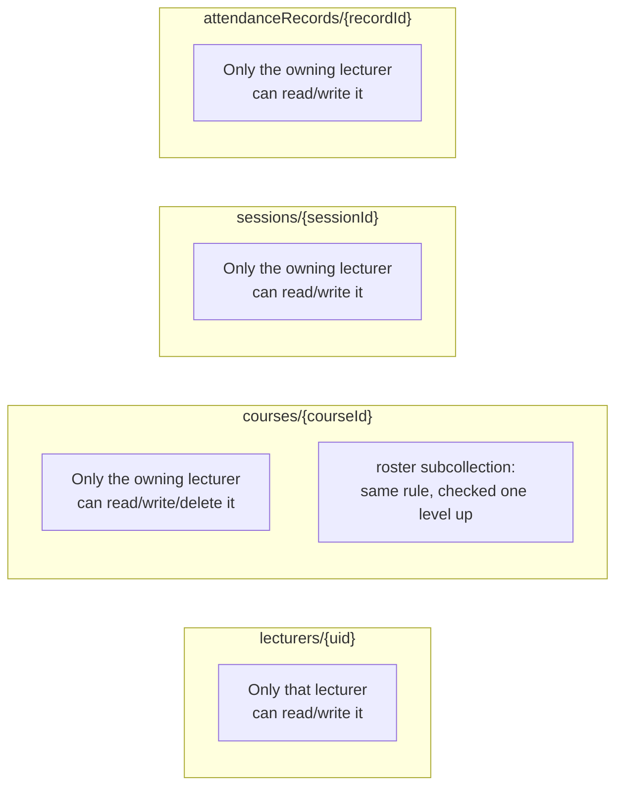

# 06 — Firestore Security Rules

## ⚠️ The single most important operational fact about this project

**Firestore security rules are NOT deployed when you push code to GitHub or
deploy to Vercel.** The file `firestore.rules` in this repo is just a text
file sitting in the project — it has **zero effect** on the live database
until someone manually:

1. Opens the [Firebase Console](https://console.firebase.google.com)
2. Goes to **Firestore Database → Rules**
3. Copies the *entire* contents of `firestore.rules`
4. Pastes it into the Console's editor, replacing whatever's there
5. Clicks **Publish**

This is not a limitation of this project specifically — it's how Firestore
rules work for every project, and there is no CLI/CI automation currently
set up for it here. **This has caused real production bugs before** — a
lecturer's live attendance list silently showed 0 students for a while
because the rules controlling that specific read had been edited in the
repo but never actually published to the live database. If you ever change
`firestore.rules` and something that used to work stops working, this is
the first thing to check.

## What the rules actually say, in plain English



Every collection follows the exact same shape: **a lecturer can only ever
read or write documents where that document's own `lecturerId` field
matches their own login ID.** There is no separate "admin" role, no
cross-lecturer visibility of any kind, and no rule anywhere that lets a
student read or write anything directly — students only ever reach the
database through server-side API routes (see `03-architecture.md`).

## The one genuinely subtle rule, explained carefully

```javascript
match /sessions/{sessionId} {
  allow read: if isOwner(resource.data.lecturerId);
  ...
}
```

This single line covers **two very different kinds of database access**:

- Reading **one specific session** by its ID (a "get")
- Reading **a list of sessions matching a query**, e.g. "give me all
  sessions where `lecturerId == me`" (a "list")

For a **list/query** request, Firestore does not just check "would each
returned document individually pass the rule" — it evaluates whether the
**query itself**, as written, can be *proven* to only ever return documents
satisfying the rule. If your rule checks `resource.data.lecturerId` but your
query doesn't include a matching `where("lecturerId", "==", ...)` clause,
Firestore rejects the **entire query** with `permission-denied` — even if,
in practice, every document that would have been returned actually did
belong to that lecturer.

**This is exactly what caused a real bug in this project.** The function
that streams live attendance records to a lecturer's session board
originally queried only `where("sessionId", "==", sessionId)` — with no
`lecturerId` filter — and got rejected outright, even though every record
for a given session obviously does belong to that session's own lecturer.
The fix was adding an explicit `where("lecturerId", "==", lecturerId)`
clause to the query itself (see `subscribeToRecords()` in
`src/lib/firestore.ts`), so the query can be *proven* safe by its own
structure, not just by what the data happens to contain.

**The lesson for any future query added to this codebase:** if a
collection's rule checks a field, your query must explicitly filter on that
same field too, even if you're confident every result would pass anyway.

## Why the rules don't need to know anything about students at all

Every rule in this file only ever mentions `lecturerId` — there is no rule
anywhere granting students any access, not even read access to a session's
public-facing info. That's intentional: the `/attend/[sessionId]` and
`/s/[slug]` pages never talk to Firestore directly at all. They call Next.js
API routes, which use `firebase-admin` (the Admin SDK) — a completely
separate credential-based connection that **bypasses these rules entirely**.
See `03-architecture.md` for the full diagram of this split, and
`07-api-routes.md` for exactly what server-side checks replace the rules for
that traffic instead.

## The full current rules file, for reference

See `firestore.rules` in the project root — it's kept short and heavily
commented on purpose, since it's edited rarely and needs to be re-read
carefully (and re-published!) every time it changes.
